# Customer Intelligence Hub - CRM

An intelligent Customer Relationship Management system powered by AI agents, designed to analyze customer data, create targeted marketing campaigns, and provide actionable business insights.

## Overview

Customer Intelligence Hub is an AI-powered system that combines customer data analysis with automated marketing capabilities. It uses LangGraph for agent orchestration, PostgreSQL for data storage, and Model Context Protocol (MCP) for tool integration.

## Architecture

```mermaid
graph TB
    A[👤 User] --> B[🤖 Neo AI Agent]
    B --> C[🔧 MCP Tools Layer]
    
    C --> D[🗄️ PostgreSQL Server]
    C --> E[📧 Marketing Server]
    C --> F[💬 Slack Server]
    
    D --> G[(📊 Customer Database)]
    G --> H[👥 Customers]
    G --> I[💰 Transactions]
    G --> J[📈 RFM Analysis]
    G --> K[🎯 Campaigns]
    
    E --> L[📝 Campaign Creation]
    E --> M[✉️ Email Automation]
    
    F --> N[🔔 Team Notifications]
    F --> O[💡 Insights Sharing]
    
    B --> P[📊 LangSmith Tracking]
    
```



## Key Features

- **AI-Powered Customer Analysis**: Automated RFM (Recency, Frequency, Monetary) analysis
- **Smart Marketing Campaigns**: Create and manage targeted campaigns based on customer segments
- **Real-time Data Queries**: Natural language interface to query customer and sales data
- **Slack Integration**: Share insights and updates with your team automatically
- **Comprehensive Tracking**: Full observability with LangSmith integration

## Benefits

- **🎯 Targeted Marketing**: Identify high-value customers and create personalized campaigns
- **📊 Data-Driven Insights**: Get instant answers about customer behavior and sales performance
- **⚡ Automation**: Reduce manual work with automated campaign creation and email sending
- **👥 Team Collaboration**: Keep everyone informed with Slack notifications
- **📈 Performance Tracking**: Monitor all AI interactions and decisions with LangSmith
- **🔄 Scalable Architecture**: Built with modern tools for enterprise-grade performance

## Quick Start

### Prerequisites

- Docker and Docker Compose
- OpenAI API Key
- LangSmith API Key (optional, for tracking)
- Slack Bot Token (optional, for Slack integration)

### Running with Docker (Recommended)

1. **Clone the repository**
   ```bash
   git clone <repository-url>
   cd customer-intelligence-hub
   ```

2. **Configure environment variables**
   ```bash
   cp .env.example .env
   # Edit .env with your API keys
   ```

3. **Start the system**
   ```bash
   docker-compose up --build -d
   ```

4. **Import sample data**
   ```bash
   docker-compose exec customer-intelligence-hub bash -c "cd database && uv run python generate_data_tables.py"
   ```

5. **Start the interactive CLI**
   ```bash
   docker-compose exec customer-intelligence-hub uv run python cli/interactive_cli.py
   ```

### Running Locally

1. **Install dependencies**
   ```bash
   uv sync
   ```

2. **Set up PostgreSQL database**
   ```bash
   # Start PostgreSQL locally or use Docker
   docker run -d --name postgres \
     -e POSTGRES_DB=crm_database \
     -e POSTGRES_USER=crm_user \
     -e POSTGRES_PASSWORD=crm_password \
     -p 5432:5432 postgres:15-alpine
   ```

3. **Configure environment**
   ```bash
   cp .env.example .env
   # Update DATABASE_URL for local PostgreSQL
   ```

4. **Initialize database**
   ```bash
   cd database
   uv run python generate_data_tables.py
   ```

5. **Run the CLI**
   ```bash
   uv run python cli/interactive_cli.py
   ```

## Usage Examples

Once the system is running, you can ask Neo (the AI agent) questions like:

- **Customer Analysis**: "How many customers do we have?" or "Show me the top 5 customers by spending"
- **Product Insights**: "What are our best-selling products?" or "Which products have the highest margins?"
- **Marketing Campaigns**: "Create a loyalty campaign for VIP customers" or "Send a re-engagement email to inactive customers"
- **RFM Analysis**: "Show me the RFM analysis of our customers" or "Who are our most valuable customers?"

## Configuration

### Environment Variables

| Variable | Description | Required |
|----------|-------------|----------|
| `OPENAI_API_KEY` | OpenAI API key for AI agent | Yes |
| `DATABASE_URL` | PostgreSQL connection string | Yes |
| `LANGSMITH_API_KEY` | LangSmith tracking (optional) | No |
| `SLACK_BOT_TOKEN` | Slack integration (optional) | No |
| `SLACK_TEAM_ID` | Slack team ID (optional) | No |

### MCP Servers

The system uses three MCP servers:
- **PostgreSQL**: For database queries and analytics
- **Marketing**: For campaign creation and email automation  
- **Slack**: For team communication and notifications

## Project Structure

```
customer-intelligence-hub/
├── src/crm_agent/           # Core agent logic
│   ├── agent_graph.py       # LangGraph workflow
│   ├── system_prompts.py    # AI agent prompts
│   └── mcp_servers/         # MCP server configurations
├── cli/                     # Interactive command-line interface
├── database/                # Database setup and sample data
├── docker-compose.yml       # Docker orchestration
└── pyproject.toml          # Python dependencies
```

## Troubleshooting

### Common Issues

**Database Connection Error**
```bash
# Check if PostgreSQL is running
docker-compose ps
# Restart if needed
docker-compose restart postgres
```

**Missing Dependencies**
```bash
# Rebuild containers
docker-compose down
docker-compose up --build
```

**Empty Database**
```bash
# Re-generate sample data
docker-compose exec customer-intelligence-hub bash -c "cd database && uv run python generate_data_tables.py"
```

### Monitoring

- **LangSmith Dashboard**: https://smith.langchain.com/ (project: `customer-intelligence-hub`)
- **Database Status**: `docker-compose exec postgres psql -U crm_user -d crm_database -c "\dt"`
- **Container Logs**: `docker-compose logs customer-intelligence-hub`

## Contributing

1. Fork the repository
2. Create a feature branch
3. Make your changes
4. Submit a pull request

## License

This project is licensed under the MIT License - see the LICENSE file for details.